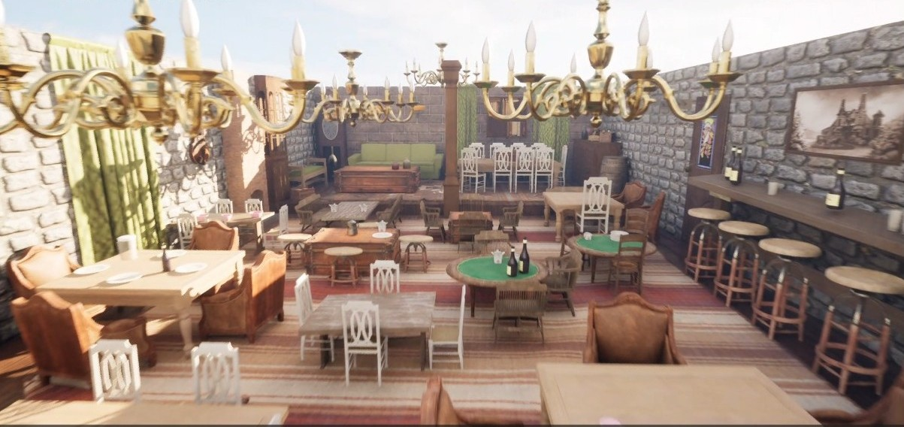
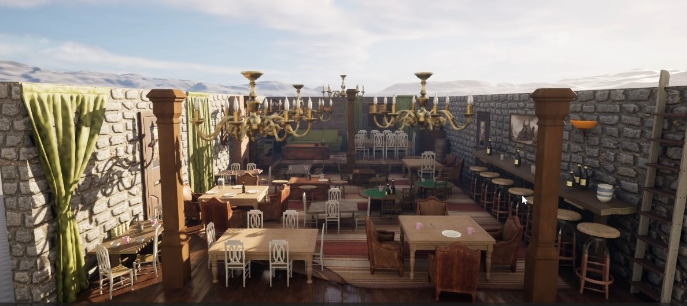
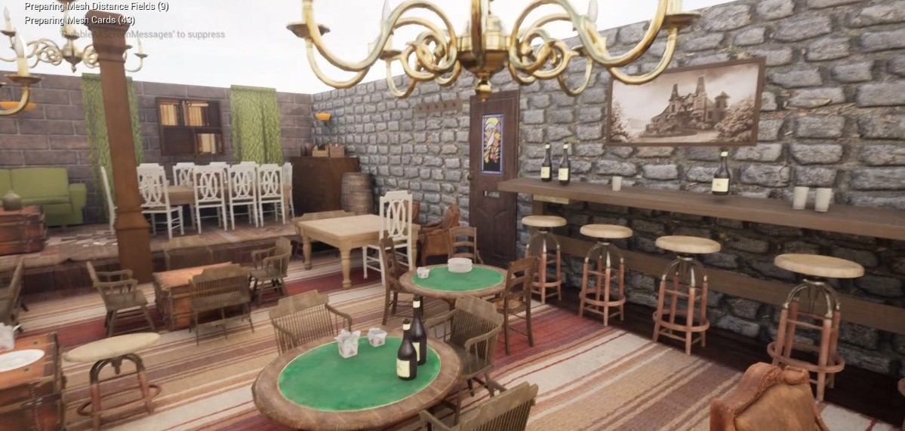

# Unreal Level Design

A level design and environment composition study created in Unreal Engine 5.

This project focuses on level design, environment composition, prop placement, and visual storytelling using Unreal Engine 5.
The environment was created using marketplace and third-party assets, while the overall layout, atmosphere, object placement, and scene composition were designed and assembled by me.

## Software

* Unreal Engine 5

## Focus Areas

* Level Design
* Environment Composition
* Prop Placement
* Lighting
* Visual Storytelling

## Gallery

